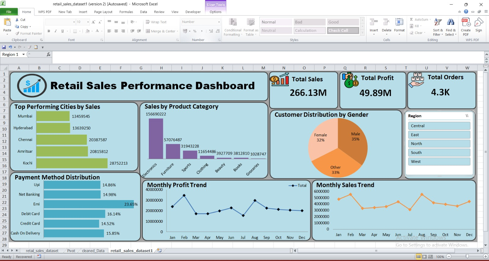
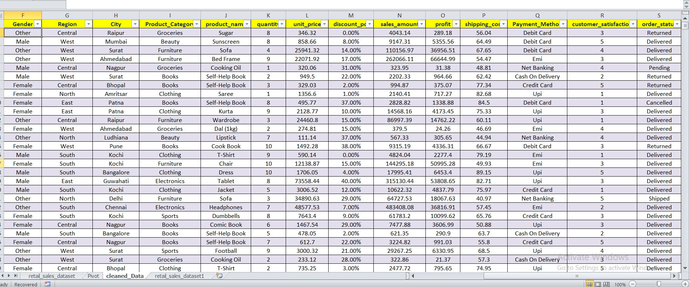
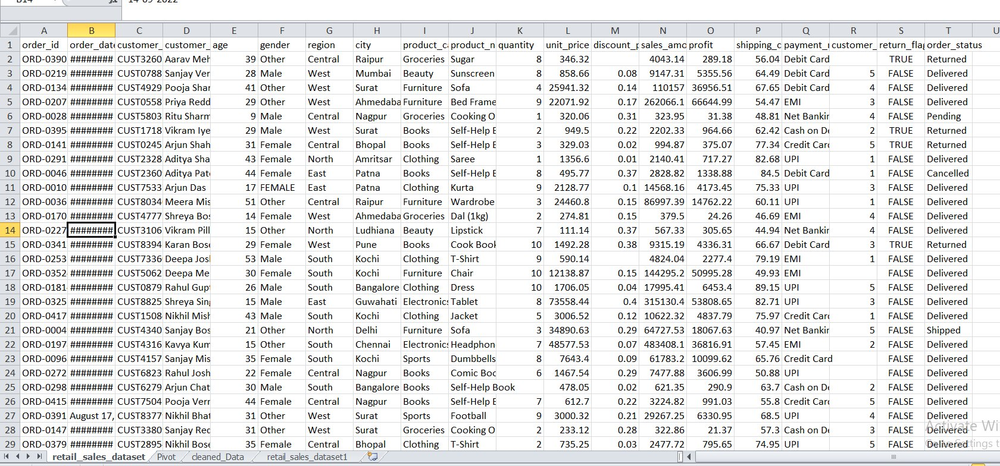

# 🛍️ Retail Sales Performance Dashboard

## 📌 Project Overview

This project analyzes a retail sales dataset to uncover business insights using **Microsoft Excel**. The workflow includes data cleaning, exploratory data analysis (EDA), pivot table analysis, KPI creation, and an interactive dashboard.

The objective was simple:

> **"If I were the owner of this business, what insights would I want to know?"**

Instead of creating random charts, the dashboard focuses on answering real business questions that support better decision-making.

---
---

Video project explaining Link - https://www.linkedin.com/feed/update/urn:li:activity:7488095328068542464/
---


---



---
# 🎯 Business Objectives

This dashboard helps answer questions such as:

- Which cities generate the highest sales?
- Which product category contributes the most revenue?
- How do sales and profit change over time?
- Which payment methods are most preferred?
- What is the customer distribution by gender?
- Which regions perform better than others?

---

# 🧹 Data Cleaning

The dataset was cleaned before analysis to ensure accurate insights.

### Cleaning Steps

- Removed duplicate records
- Standardized Gender values
- Handled missing values
- Treated invalid Age values
- Validated Quantity and Discount values
- Corrected inconsistent data formats
- Cleaned categorical columns

---

# 📊 Dashboard KPIs

The dashboard provides a quick overview of business performance using the following KPIs:

- 💰 Total Sales
- 📈 Total Profit
- 📦 Total Orders

---

# 📈 Dashboard Visualizations

The dashboard includes the following analyses:

### 🏙 Top Performing Cities by Sales
Identifies the cities generating the highest revenue.

### 📦 Sales by Product Category
Compares revenue contribution across product categories.

### 👥 Customer Distribution by Gender
Shows the percentage of customers by gender.

### 💳 Payment Method Distribution
Displays customer payment preferences.

### 📅 Monthly Sales Trend
Tracks monthly revenue performance.

### 📈 Monthly Profit Trend
Tracks monthly profitability throughout the year.

---

# 🎛 Interactive Filter

The dashboard includes a **Region Slicer**.

By selecting a region, **all KPIs, charts, and visualizations update automatically**, allowing users to analyze business performance for a specific region without changing the dashboard structure.

This enables quick comparisons between regions and helps identify regional trends and opportunities.

---

# 💡 Key Insights

- Electronics is the highest revenue-generating product category.
- Kochi is the top-performing city by sales.
- EMI is the most preferred payment method.
- Customer distribution is nearly balanced across genders.
- Monthly sales fluctuate throughout the year, with noticeable peaks during specific months.
- 
When a specific region is selected, **all KPIs, charts, and insights update automatically** to reflect the performance of that region.

This allows users to quickly compare business performance across different regions without modifying the dashboard.

Using the slicer, users can analyze:
---

# 🛠 Tools Used

- Microsoft Excel
- Pivot Tables
- Pivot Charts
- Slicers
- Conditional Formatting
- Dashboard Design

---

# 📂 Project Workflow

```
Raw Dataset
      ↓
Data Cleaning
      ↓
 Data Analysis
      ↓
Pivot Tables
      ↓
Interactive Dashboard
      ↓
Business Insights
```


# 🚀 Conclusion

This project demonstrates how Excel can be used not only for reporting but also for solving real business problems through data analysis.

The dashboard transforms raw sales data into actionable insights, enabling business users to monitor performance, compare regions, and make informed decisions using interactive visualizations.
